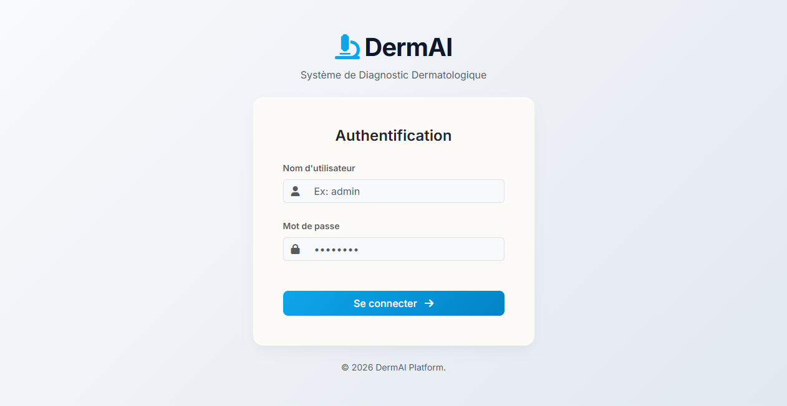
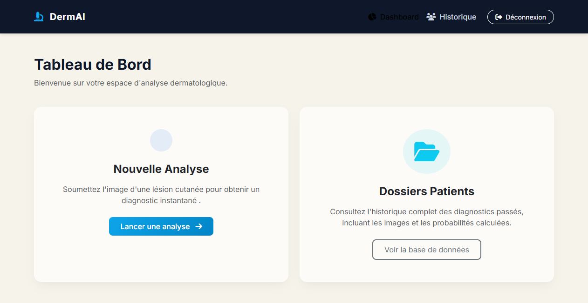
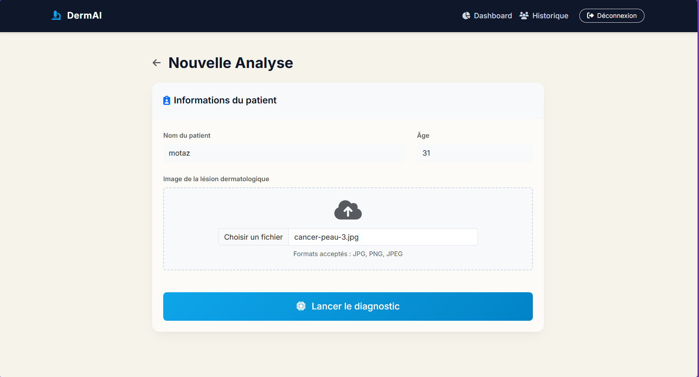
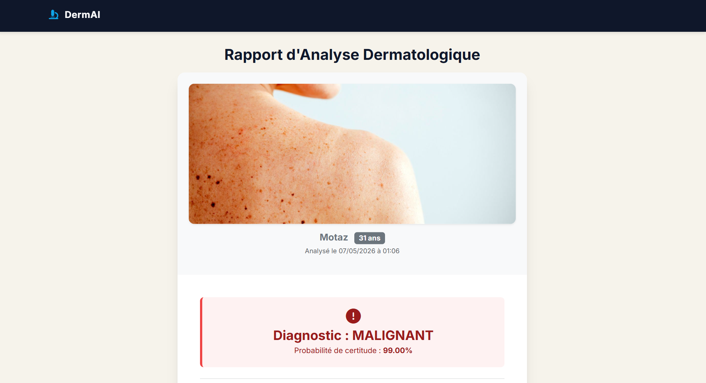
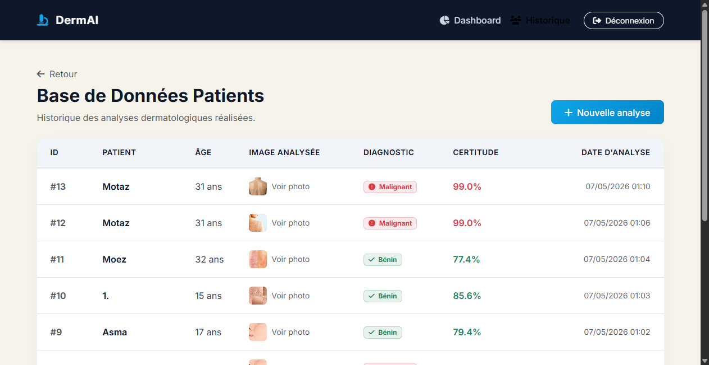

# DermAI Clinical Interface - Détection du Cancer de la Peau

DermAI est une application web clinique développée avec **Flask** et **TensorFlow/Keras**. Elle permet aux professionnels de santé de télécharger des images de lésions cutanées et d'utiliser un modèle de Deep Learning (VGG16) pré-entraîné pour obtenir une prédiction immédiate sur la nature de la lésion (Maligne ou Bénigne). 

## 🩺 Fonctionnalités Principales

- **Authentification Sécurisée** : Espace réservé au personnel médical (login / mot de passe).
- **Interface Clinique Professionnelle** : Design épuré, thème bleu médical adapté aux environnements cliniques.
- **Analyse d'Image par IA** : Classification automatique (Malignant / Benign) grâce à un modèle d'apprentissage profond.
- **Gestion des Patients** : Enregistrement des informations du patient (nom, âge), de l'image de la lésion, et du résultat du diagnostic dans une base de données MySQL.
- **Historique des Diagnostics** : Consultation de l'ensemble des cas traités via un tableau de bord.

## 🛠️ Technologies Utilisées

- **Backend** : Python, Flask
- **Machine Learning** : TensorFlow, Keras (Modèle VGG16)
- **Base de données** : MySQL
- **Frontend** : HTML5, CSS3 (Vanilla), Jinja2
- **Serveur local** : XAMPP ou WAMP (pour MySQL)

## 📸 Captures d'Écran

*(Ajoutez vos captures d'écran dans le dossier `screenshots/` avec les noms correspondants)*

### Page de Connexion


### Tableau de Bord (Dashboard)


### Interface de Diagnostic (Prédiction)


### Résultat du Diagnostic


### Historique des Patients


## 🚀 Installation et Utilisation

### Prérequis
- **Python 3.x**
- **XAMPP / WAMP** (pour faire tourner le serveur MySQL local)
- **Git**

### Étapes de configuration

1. **Cloner le dépôt :**
   ```bash
   git clone https://github.com/belghilomar/SKIN_CANCER_APP.git
   cd SKIN_CANCER_APP
   ```

2. **Installer les dépendances Python :**
   ```bash
   pip install -r requirements.txt
   ```

3. **Configurer la base de données :**
   - Lancez Apache et MySQL depuis le panneau de contrôle XAMPP.
   - Ouvrez phpMyAdmin (`http://localhost/phpmyadmin`).
   - Importez le fichier `database.sql` fourni à la racine du projet. 
   - *Les identifiants par défaut pour tester l'application sont : **Utilisateur :** `admin`, **Mot de passe :** `1234`*

4. **Modèle IA :**
   - Placez votre modèle pré-entraîné `vgg16_skin_cancer.h5` dans le dossier `model/`.

5. **Lancer l'application :**
   ```bash
   python app.py
   ```
   L'application sera accessible sur `http://127.0.0.1:5000`.

## 📁 Structure du Projet

```text
SKIN_CANCER_APP/
│
├── app.py                  # Point d'entrée de l'application Flask
├── database.sql            # Script de création de la base de données
├── train_model.py          # Script pour l'entraînement du modèle VGG16
├── requirements.txt        # Fichier des dépendances Python
├── static/
│   ├── style.css           # Feuille de style principale (Thème bleu clinique)
│   └── uploads/            # Dossier où les images des lésions sont stockées
├── templates/              # Vues HTML (Jinja2)
│   ├── login.html
│   ├── dashboard.html
│   ├── predict.html
│   ├── result.html
│   └── patients.html
├── screenshots/            # Dossier contenant les captures d'écran
└── model/
    └── vgg16_skin_cancer.h5 
```


